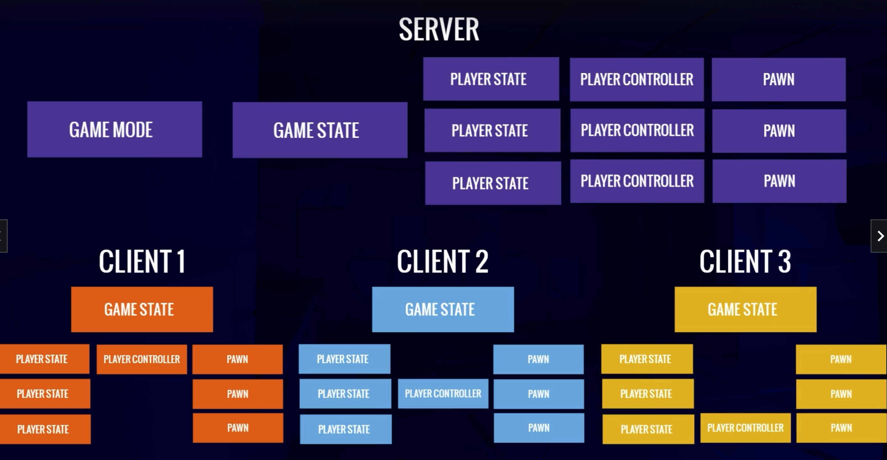

# UE5-MultiplayerShooter
## 开发日记：
---
## 一、项目创建
### 1. 加入插件

### 2. 资源导入

### 3. 动画重定向
使用骨骼约束系统（IK Rig）和骨骼重定向器（IK Retargeter）

### 4. 角色创建
移动方向：
- pitch：绕x轴（俯仰）
- yaw：绕z轴（左右方向旋转）
- roll：绕y轴（竖直方向旋转）

### 5. 角色动画

### 6. 无缝传送和大厅
1) Non-Seamless Travel(非无缝传送)：客户端从服务器端断开连接，客户端重连至相同服务器。发生情况：第一次加载地图，第一次连接至服务器，当结束或开始一个多人游戏。  
2) Seamless Travel（无缝切换）：客户端无需从服务器断开连接，避免了重联时遇到的网络问题，更加丝滑。在`Game Mode`中启用，需要一个transition map，这个地图需要已经被加载完成（这样就省去了同时存在两张大地图的资源消耗）。 

### 7. 网络角色
分别有以下几种不同的网络角色：
- `ENetRole::ROLE_Authority`: 服务器上的权威角色
- `ENetRole::ROLE_SimulatedProxy`: 客户端上看到的其他玩家控制的角色
- `ENetRole::ROLE_AutonomousProxy`: 自己客户端上可控制的角色
- `ENetRole::ROLE_None`: 没有定义角色的actor

local role和remote role的区别：
- local role：在客户端上显示的为控制的角色为`Autonomous`和其他客户端上的角色`Simulated`；而在服务器端角色显示都为`Authority`
- remote role：在客户端上显示的为在服务器端的网络角色即`Authority`；而在服务器端则显示控制的角色为`Autonomous`和相应的`Simulated`

## 二、武器
### 1. 创建武器类

### 2. 拾取武器显示

### 3. 武器复制变量
在网络系统中注册了可复制的变量，解决了只能在服务端显示拾取武器控件的问题，能通过服务端复制武器到客户端，使用`DOREPLIFETIME_CONDITION`来限制只在有所有权的服务端或客户端复制武器，其他客户端不会同步该武器。  
并且通过委托函数（通过宏设置`ReplicatedUsing`）来触发回调函数`OnRep_`（里面能够通过参数保存原属性的旧值）来设置人物与武器重叠时的拾取武器控件的显示与关闭。

### 4. 装备武器
- 使用了Actor Component来创建一个在人物角色上的新组件用来装备武器
- 为`CombatComponent`添加人物角色的友元类以将所有访问权限暴露给角色类
- 在多个类中为了获取私有变量，创建内联函数`FORCEINLINE`的get或set函数来减少性能开销。在内联函数中，函数体的代码被肢解插入到调用该函数的地方，因此不需要进行函数调用的相关开销，如压栈、跳转、返回值处理等。相比于函数调用，内联函数的执行速度更快。

### 5. 远程过程调用（RPC）
1) Remote Procedure Call是指在客户端和服务器之间发送函数调用消息的机制。当客户端需要通知服务器执行某个函数时，客户端可以通过RPC将函数调用消息发送给服务器，并在服务器上执行该函数；服务器同理。  
2) RPC分为可靠的与不可靠的：
   - 可靠：确保RPC调用被成功接收并处理，如果网络出现问题会尝试重传RPC调用，直到成功处理。基于TCP协议，保证了数据的可靠性和正确性，比如玩家角色位置的同步
   - 不可靠：可能会在网络中被丢失。基于UDP协议，用于快速传输RPC调用，但不保证数据的可靠性和正确性；可能会出现数据丢失或顺序错乱等问题，比如玩家角色的伤害计算
3) 在UE中，对于声明了RPC的函数，需要在其后面添加一个函数名为原函数名+`_Implementation`的实现函数，用于处理服务器上实际执行该RPC所需的逻辑。这样设计的原因是：RPC系统基于反射机制（在程序运行时动态调用函数）实现的，使得RPC函数的调用和实现可以分离，从而更好的实现了代码解耦性和可维护性。
4) 通过将变量设置为replicated，如果这个变量在服务端**发生改变**（如果没有发生变化则不起作用）并设置为true，在客户端上会被复制也设置为true，此时调用Rep_Notify可以在所有客户端上复刻服务端上的动作。

### 6. 装备武器动画姿势
因为上面仅在服务器端给武器类中的EquippedWeapon赋值了，客户端中的依然为null，这时就需要给武器类中的EquippedWeapon也设置为Replicated。  
一旦涉及这个过程都需要为该变量加上`UPROPERTY(Replicated)`，并重写`GetLifetimeReplicatedProps`虚函数。

### 7. 下蹲
UE中自带Crouch和UnCrouch内置函数（考虑了多人在线游戏因素），这个内置函数中`bIsCrouched`变量是可复制的所以可以复制到所有客户端，并且还实现了如**重置胶囊体**和移动速度切换等，大大减少了重复造轮子的时间。

Tilde符号即~，可以用作运行游戏时打开控制台的快捷键；能够查看和修改游戏状态，执行各种命令（如添加物体，碰撞检测等）

### 8. 瞄准
在`CombatComponent`中把诸如`EquippedWeapon`, `bAiming`等变量都设置为`Replicated`；这些属性将被自动在客户端上复制，从而实现服务器与客户端之间的同步。这里使用`ServerSetAiming`作为RPC会在客户端上调用服务器上的函数，服务器将更该应用于自己的状态并分发给所有已连接的客户端进行同步，因为该函数被标记为了`Server Reliable`所以只有服务器可以调用它并建立可靠的RPC服务。

>计算旋转偏移Yaw Offset过程：
1) 获取角色的基础瞄准旋转（Base Aim Rotation），即没有偏移时的瞄准旋转；
2) 获取角色的运动方向，通常是角色的速度向量，然后将其转换为一个旋转矢量；
3) 计算角色的运动方向与瞄准方向之间的旋转差（Delta Rotation）；
4) 将旋转差转换为一个浮点数值，通常是旋转差的Yaw轴（水平旋转轴）分量；
5) 使用差值算法（如线性插值或插值函数）逐渐调整Yaw Offset的值，使其向目标值靠近。

如：当玩家瞄准时，游戏会计算出身体需要旋转的角度，然后将这个角度缓慢地应用到角色的旋转中。这样，身体的旋转速度就可以逐渐与头部的旋转速度同步，从而保证射击时枪口不会偏离目标。  
在第三人称射击游戏中，角色的枪口和准心通常不在同一位置，而且准心的位置通常是固定的，不会随着角色的移动而变化。另外，角色身体的旋转和移动方向通常也不是完全与准心对齐的，这就导致了准心和角色的瞄准方向存在差异。为了让玩家能够更准确地瞄准，需要通过瞄准偏移来修正这种差异，让准心与实际瞄准方向对齐。

### 9. 横向移动以及身体倾斜
通过旋转root角度制作lean的动画，在混合空间blendspace中填入。  
为了配合身体的旋转，需要在服务端和客户端均禁用`OrientationRoration`（使用了RepNotify）  
计算身体倾斜lean时，记录了上一帧角色朝向，通过与当前帧的角色朝向的差值计算出朝向的变化率，即每秒的旋转角度；接着通过插值（Interpolation）计算出当前帧的身体倾斜状态并将其限制在-90到90度之间。对于横向则使用了`RInterpTo`使其有一个平滑的过渡。

### 10. 瞄准偏移
当人物处于装备武器站立状态时，此时人物上半身瞄准状态应该跟随鼠标移动，而下半身应保持静止状态。  
>当客户端发送Pitch（水平方向的旋转即俯仰视，限制在了-90到90度之间）到服务端时或服务器分发给客户端时，需要经过一个函数将角度压缩成size更小的short类型；因此负角度就会转换成[0->360)的度数，再通过与0xFFFF比特相与映射到[0->65536)，再传到服务器或其他客户端时再解压缩到[0->360)之间的度数，这就会造成当人物俯视时在其他客户端显示为仰视。

使用了Cashed Pose来分别存储我们装备武器后的身体以及瞄准姿态时的身体，使用layered blend按照spine_01将身体的上下部分分开；使用缓存姿势时，可以利用已经存在的动画资源，并通过设置适当的姿势转换规则来动态地生成动画，从而提高运行效率。另外，Cached Pose还支持在多个线程上进行计算，从而进一步提高效率。

**FABRIK IK（反向运动学）**，以使角色的左手到左肩这一部分（Solver）根据末端执行器右手（已Attachment绑定武器的transform以骨骼为参考系）能够自然地移动并正确地与手持枪械处于正确位置。在 Fabric IK 中，可以根据 end effector 的位置来调整 IK solver 的目标位置，以便更好地适应角色的运动和变化。 

### 11. 人物静止持枪旋转
新建了一个头文件专门存储转动的枚举类型，分别为：向左转，向右转，不转。为了使枪口方向在旋转90度过后角色跟随旋转；新建了一个插值InterpAO_Yaw，当它不断趋近于0度时，在小于一定阈值时使人物平滑过渡并不再处于旋转状态。

### 12. 网络更新频率
在进行多客户端测试时会发现，当在其他非控制客户端显示角色动画时，会产生抖动问题，解决方法：
- 针对人物骨骼旋转的Clamp中开启Interp Result，将旋转结果限制在一定范围内，避免角度值过大或过小出现不合理旋转效果
- 设置角色的网络更新频率（常用值为66）和最小网络更新频率（常用值为33）
- 更改配置文件中的DefaultEngine，设置NetServerMaxTickRate = 60

### 13. 添加脚步声和跳跃音效
在行走动画上添加Notify Track，使用Sound Notifies可以在所有客户端上的角色正常同步运行。  
使用Notify Sound Sync用来创建同步声音事件，用于处理网络同步音频问题。  
同时给动画帧数上添加音效时需注意按总长规律添加，否则重复循环播放会造成音画不同步问题。

## 三、武器开火
### 1. 武器开火类别
Projectile vs Hitscan：  
投射物攻击方式：
- 发射一个投掷物projectile
- 有一个速度
- 有/没有重力（榴弹炮或火箭筒）
- 碰撞事件
- tracer particles轨迹粒子

射线追踪方式：
- line trace射线追踪
- 即时命中
- Beam particles光束粒子

### 2. 开火动画
为每个开火动画加上additive animation，为了在原有动画姿势和骨骼不变的情况下播放开火动画。

### 3. 实现多客户端实现开火效果
如果单单使用Server RPC只会在服务器上实现开火效果，而不会分发到各客户端上；这是因为之前通过Server RPC实现的服务器分发客户端效果使用了Replicated变量的效果，但Replicated变量只有在发生改变的时候才会成功复制到各客户端上，然而如果我们想实现自动开火即bFireButtonPressed一直为true，则它不会复制到各个客户端上，只会在服务端显示。  
此时引进了**NetMulticast**这个RPC通信技术，当它在服务端被触发时，会分发到服务端以及所有客户端上，很好的并且十分简洁的帮我们实现了网络传递的效果；但如果它在客户端被触发则仅会在被触发的客户端上实现，所以需要借用一层ServerFire函数使其先在服务端上被触发。

### 4. 命中目标
新建了一个私有变量HitTarget，通过TraceUnderCrosshairs为其赋值。设置viewport位置屏幕中央转换为world世界坐标系后通过linetrance设置HitTarget。

### 5. 实现多客户端命中事件
由于RPC调用需要占用网络带宽，我们不能为所有的replicated变量做RPC调用，此时需要采用其他更为高效的办法；这时我们发现Destroy()函数里实现了广播效果，所以在重写后的Destroy()函数中加入命中产生的例子效果和音效，在里面实现服务端到所有客户端的传递。

### 6. 子弹壳类
为每个武器添加统一子弹壳名的socket，在总weapon类中添加sub子弹壳变量，为了给继承总武器类的不同的枪械配置不同的弹壳类。相当于简易版的开火flash socket实现。

需要设置弹壳与摄像机的碰撞为Ignore，否则会产生镜头与弹壳碰撞畸变问题  
同样需要设置Hit Event（蓝图中的命名与C++中不同）

弹壳掉落声音：设置音效attenuation回声的inner radius为200（播放全部声音），falloff distance为1500指声音传播的距离，当距离超过该值时，声音的音量和衰减程度会逐渐减小，直至听不到为止。

## 四、武器瞄准机制
### 1. HUD和player controller
新建玩家控制类和HUD类；  
HUD类中存在`DrawHUD()`函数，会被每帧调用，在这里画十字瞄准线。十字瞄准线的texture写在weapon类中：上下左右（横线竖线）以及中心（一个点）；  
创建HUD类对应的蓝图，并在GameMode添加；  
创建Controller类对应的蓝图，并在GameMode中添加；  
在HUD类中创建一个集合了五个材质的十字瞄准线结构体，并将其设置为HUD类的私有变量并创建对应的set函数；  
在Combat组件中加入设置十字瞄准线的函数，并传入deltatime因为要设置interpolation，并在tick函数中调用了该函数；  
在Combat组件类中加入hud类和controller类成员；  
在获取到controller的hud后，如果有EquippedWeapon，设置十字瞄准线结构体的五个变量为装备武器中存储的对应瞄准线texture，否则置空；  
调用HUD类自己的set瞄准线函数。

### 2. 将十字瞄准线显示到视图上
因为一共要画五个图像，添加一个DrawCrosshair函数供每个图像调用设置到屏幕中心位置；设置瞄准点的位置时要注意减去原材质的一半长度，并调用Texture画到中心点的位置（包含多个参数）

在计算机图形学中，纹理坐标通常使用U和V表示。它们是二维坐标系，用于定位纹理图像上的特定像素或纹理区域。
- U坐标（也称为水平坐标）表示纹理图像中的水平位置。它的范围通常从0到1，其中0表示纹理的左边缘，1表示纹理的右边缘。
- V坐标（也称为垂直坐标）表示纹理图像中的垂直位置。它的范围通常从0到1，其中0表示纹理的上边缘，1表示纹理的下边缘。

### 3. 设置瞄准线发散效果
在HUD类中的FHUD结构体中添加spread的浮点型变量，但传入draw函数的时候需要FVector2D变量，因为我们发散的度数一样的，但是方向正负不同；  
创建一个成员变量MaxSpread暴露给蓝图更方便调整扩散大小，传入draw函数是为五个图像设置不同的Spread参数；  
在这里FVector2D的UV坐标系向上是y的负方向；  
在Combat组件中设置FHUD结构体中添加spread的浮点型变量的值，一般扩散大小与人物速度动态相关，所以我们需要将人物速度（0-600）映射到0-1的区间内；  
为十字瞄准扩散大小再新增一个在空中时的控制变量与前者相加，这个空中spread使用interpolate让它平滑缓慢的扩散到指定大小

### 4. 纠正武器瞄准位置与中心点不一致问题
通过右手的socket位置与hittarget的目标点位置得到右手的旋转角度（因为x轴方向相反需要调整为相反方向）；  
在动画蓝图中使用右手旋转角度，调整fabric位置；  
为了减少带宽 消耗，我们不需要使每个机器上都有这个旋转角度，只需保证控制主机使用该旋转角度对准即可；  
为了使动画蓝图中也保证本地控制，需要在动画实例类文件中添加bool变量判断，而不能在蓝图中直接使用is locally controlled（线程不安全）；  
解决bug：枪口方向错乱，因为射线射向远处如天空时没有碰撞点，所以需要加入block碰撞判断，直接设置ImpactPoint为终点

### 5. 不同武器的瞄准放大
在武器类和Combat组件类中分别设定Zoom的大小，和Zoom的速度；  
需要通过摄像机得到默认的以及当前的视野范围，并且设置摄像机的FOV；  
设置默认状态下的FOV和当前状态下的FOV，通过是否瞄准的bool变量来设置FOV的值；  
针对不同的武器我们可以设置不同的FOV（比如步枪和狙击枪）；
但是当镜头拉近时会造成模糊背景的问题，此时需要增大摄像机的景深（DOF），并增大F-stop以减小光圈大小产生较大的景深，使图像整体保持清晰

### 6. 瞄准时准星收缩以及射击时准星扩散
在Combat组件类中再添加一个浮点型aim因子，在计算瞄准spread时加上该变量，为防止收缩成0加上一个基准值；  
添加浮点型shoot因子，在开火函数时设置改值，并且要interpolate该值到0再加到spread变量中，因为射击时准星扩散后应马上回到原始值

### 7. 改变准星颜色
为了使在命中目标时准星颜色变红，我们需要让人物类继承自Interface类；  
在FHUD结构体中添加颜色变量，将HUD添加为成员变量，为了在UnderTrace函数中使用并且给颜色赋值；  
在人物类中设置与Visibility的碰撞检测为block；  
因为从远处转移到目标人物时hittarget突然变近会导致右手突然旋转以对准枪口方向，此时我们需要为其添加interpolation

### 8. 延伸射线
解决bug：其他角色遮挡摄像头时准星瞄准导致枪口倾斜准星变红以及靠墙时人物自己遮挡视角。  
因为射线是从摄像头中心射出的，会与角色产生碰撞，所以此时我们将射线的起始射出位置加上一段距离就可以防止其他角色的遮挡碰撞；  
添加隐藏摄像头函数，并在Tick函数中调用，判断当摄像头与人物间隔小于一定阈值时隐藏人物以及人物装备的武器

### 9. 击中目标
添加四种不同方向的受击动画（additive animation），创建对应的蒙太奇动画，在projectile类的hit函数中加入人物类的播放受击蒙太奇动画，改变人物pawn与projectile的碰撞检测为blcok，并在动画蓝图中加上hit的slot；  
为播放受击蒙太奇动画使用Multicast RPC实现服务端向客户端的传递，但是这个RPC是Unreliable的（只有在高延迟情况下会被扔掉），因为受击动画并不重要；  
新建一个collision object，用来专门描述人物的mesh碰撞体（因为原来的碰撞是靠capsule的，可能以后会造成碰撞检测不准确），这个新建的变量会占用ECC_GameTraceChannel1的位置，在Blaster类中define这个变量；  
这不会造成太多更多的消耗，因为我们瞄准的是物理模型而不是多边形。网格描述了物体的外观和形状，而物理资产用于模拟物体的物理和碰撞行为。 

### 10. 优化代理客户端上的旋转动画
！其他客户端上的旋转动画会出现抖动问题，这是因为动画蓝图的更新并不是每帧更新的而是跟随网络所更新的，所以会比tick慢一些；  
在C++中，enum其实是有整数索引的列表，所以越靠前定义的变量它越小，这时我们可以通过LocalRole > ENetRole::ROLE_SimulatedProxy来区分服务器、本地客户端与其他客户端；  
这样我们新建一个bool型的旋转root变量供人物角色和人物蓝图使用，当在本地的时候使它变为true而在其他客户端时为false；  
由于代理客户端同样也是tick每帧更新的，此时通过服务器传递的网络更新并没有tick更新快所以会出现yaw不断更新为0的情况，这时我们便需要通过replicated和notify进行网络传递；  
因为这个replicated movement变量只有在当角色移动时才会触发notify调用旋转函数，为了让角色站定状态下仍然能够旋转，我们加入一个时间阈值变量在tick中，当大于一定时间后就会触发旋转函数；  
在速度大于0即移动过程时，需要提前判断设置为不旋转状态并提前返回

### 11. 自动开火
在Combat组件类中设置开始和结束的开火时间函数，对于非自动开火武器使用bCanFire控制开火间隔时间（FireDelay）；  
在武器类中加入FireDelay，bAutomatic等变量

### 12. Option
增加了不同的击中粒子效果，通过一个新创建的粒子变量来在每一次命中玩家角色时选赋值特定的例子效果变量即可；  
增加了新的十字瞄准判断因子，当瞄准玩家角色时会适当收缩准星，通过TraceHitResult的值判断是否与角色所继承的接口相等来设置，并加入到总的CrosshairSpread；

## 五、人物生命和状态
### 1. 游戏框架
- GameMode：仅在服务器上
- GameState：在服务器和所有客户端上
- PlayerState：在服务器和所有客户端上
- PlayerController：服务器和自己的客户端
- Pawn：服务器和所有的客户端
- HUD/Widgets：仅在自己的客户端上

在服务器和客户端上的分布

### 2. 人物血量
在character类中而不是PlayerState里添加health，这是因为PlayerState是较慢的网络更新，而character有快速的replication；  
在character类中添加health为replicated变量并添加notify函数；  
创建新的health widget，在谷歌fonts中下载新字体，放在progress bar上；  
新建CharacterOverlay的类，并在其中添加与widget蓝图相同的变量，并在BlasterHUD中加上CharacterOverlay（用于添加到viewport中，并且这个是widget蓝图的父类）和CharacterOverlayClass（用于蓝图中添加，因为创建widget需要UClass）

### 3. 更新血量
使用PlayerController来访问HUD，直接使用GetHUD()就能访问到HUD；  
然后在character类中使用PlayerController来更新血量；

### 4. 伤害
新建ProjectileBullet类继承自Projectile类，并在其中重写OnHit函数事件；  
因为这里的health变量是replicated的，我们在它的notify函数中调用播放受击伤害动画而不再通过multicast RPC，更加减少网络带宽的使用；  
使用OnTakeAnyDamage来动态调用ReceiveDamage函数

### 5. Game Mode
新建继承自GameMode的类，在其中重写玩家角色被销毁的函数；  
在character类中添加Elim函数；  
在character类的ReceiveDamage函数中添加判断，当角色生命值为0时我们调用GameMode中玩家被销毁的函数，其中的参数分别是：玩家对象，受击的玩家controller，攻击的玩家controller（即character类中的instigator）

### 6. 死亡动画
使用飞升动画来创建死亡动画蒙太奇，营造一种溶解的感觉；  
在Elim函数中播放动画，并设置bool值isElimed供动画蓝图类使用；  
为了使所有客户端都播放死亡动画，需要使用Multicast RPC，并且因为该信息比较重要，需要设置成reliable

### 7. 复活
将Elim与MulticastElim分开写，因为我们需要仅在服务端实现一些功能，比如GameMode的计时；  
新增ElimTimer的计时器，并在Elim函数中进行设置；  
在GameMode中重写RequstRespawn函数；  
在计时器的回调函数中调用ElimFinished函数，在其中调用GameMode中的Respawn函数（仅在服务端上）；  
目前并没有处理人物拾取武器死亡重生后，武器仍在人物死亡位置的问题；  
如果出生点相近产生碰撞会导致无法重生，需要调整Spawn设置

### 8. 溶解效果

### 9. 死亡禁用人物状态
在玩家角色被消灭时，我们需要禁用他的移动，碰撞体以及丢掉持有武器；  

### 10. 死亡飞船
为了让飞船动画播完后在所有客户端消失，需要再次重写Destroy函数，并把销毁飞船组件的代码写在重写的Destroy函数中，像projectile一样；  

### 11. 解决重生后生命值为0的问题
在PlayerController中重写OnPossess函数，可以通过这个函数让我们在角色重生时更新生命值

### 12. PlayerState
在UE中，PlayerState 类是用于表示玩家状态的类，它通常用于存储与玩家相关的信息，如分数、生命值、经验等；  
在PlayerState中持久记录玩家角色的状态；  
PlayerController可以直接访问到PlayerState，反之不行，但是可以通过Pawn关联到Controller再来Cast得到；  
PlayerState中有内置的score变量并且是replicated的，重写已经内置的score的notify函数，添加角色类和角色控制类；  
为了确保服务端和客户端都能更新score，服务端需要单独一份函数来更新score，因为score是replicated的，它会调用Notify函数传播到所有客户端进行更新；  
为了使玩家死亡后不会重置击杀分数，我们需要保存玩家的状态，而且因为PlayerState在玩家重生后的一到两帧后才会初始化，所以需要在Tick函数中轮询初始化PlayerState；  
PlayerState 对象的初始化通常是在玩家连接到游戏服务器后进行的，而不是在第一帧时立即初始化。因此，在编写游戏逻辑时，应考虑 PlayerState 对象的初始化和同步时机，并在需要使用 PlayerState 信息时进行适当的处理

### 13. 被击杀数
与得分基本同理，但是并没有内置的replicated的defeats变量，需要自己创建，加入Lifetime并实现回掉函数；  
在GameMode的Elimated函数中调用PlayerState的更新分数和死亡数；  
UPROPERTY宏可以防止未初始化，即指针为未定义的值；

## 六、子弹
### 1. 武器子弹
为了同步服务端和客户端的武器子弹，同样需要使用replicated进行网络传递，能够保证一个玩家丢掉武器时，另一个玩家拾取该武器显示的子弹为剩下的子弹数；  
在Fire函数的最后添加消耗子弹函数；  
因为我们无法确定是owner还是武器状态先被复制到网络中，所以需要重写owner的notify回调函数，在里面添加子弹数的初始化状态；  
解决能同时捡起多个武器的问题，在Equip函数中添加判断，如果持有武器了，那么就调用Drop函数；  
需要注意在人物被消灭后，仍然需要重置子弹数的HUD为0；  
在Combat组件类中新建CanFire函数，判断条件为子弹数是否大于0和bCanFire是否为true，并且使用Clamp将子弹数控制到0-弹夹最大容量；

### 2. 武器总子弹数
新建武器类型的枚举数据，将它放到单独的一个头文件中，在Combat组件类中引入这个头文件，并定义TMap数值对类型（武器类型：携带子弹数）；  
注意尽管我们只需要在服务端上验证伤害和命中事件，但是我们需要ammo是relicated的，因为要传播到客户端上更新子弹的HUD

### 3. 换弹
为每个特定的武器提供不同的换单姿势，需要创建新的动画蒙太奇，这里先设置Rifle为第一个section；  
如果我们在客户端上，我们需要向服务端发送RPC，在服务端上确认是否能换弹并播放换弹动画；  
在换弹时我们需要禁用左手动作的FABRIK让它不会固定在枪上，所以在一个新的头文件中创建CombatState的枚举变量，在其中加上换弹状态，当切换到这个状态时就禁用FABRIK；  
为了防止状态只改变一次，仅仅只能传递一次RPC，我们可以在换弹动画蒙太奇中加上notify来通知换弹结束，可切换状态；  
为了正确更新子弹数量，所用的数据公式为：补充的子弹数 = Clamp(0, Min(弹夹数减去子弹数量，剩余总子弹数))；  
在换弹动画结束后再更新子弹数量；  

### 4. 换弹效果
添加换弹效果，音效，装备武器音效，并在换弹时禁用其他动画如瞄准；  
在开火结束时和装备武器时加入判断是否字段为空然后自动换弹

## 七、匹配状态
### 1. 匹配等待时间
加入计时器HUD显示状态，显示的形式需要使用`%02d:%02d`进行格式化，为了使其每秒更新而不是每帧更新，加入一个uint32类型判断；  
**同步服务端和客户端的时间**：因为服务端的时间与客户端上显示的时间不同，需要通过网络间传递RPC来获得服务器上的权威时间并减去往返RPC的时间（RTT往返时间）；  
我们需要创建两个RPC，一个为从客户端发送到服务端上（Server RPC），一个为从服务端返回到客户端（Client RPC）：
- 服务端接收到的是客户端发送请求的时间，
- 将客户端发送请求的时间和服务器所在的时间一并发送到客户端上，
- 客户端收到服务端发送的客户端发送请求的时间减去自身的时间得到RTT（Round Trip Time），
- 客户端收到服务端回复的当前时间加上一半的RTT（一次RPC的时间）为当钱服务端时间，
- 而当前服务端与客户端的网络延迟则为求得的当前服务端时间减去现在客户端上的时间，
- 我们计算出这个网络延迟变量后，每次获取服务器时间时，如果在服务器上直接返回当前时间；如果在客户端上，则用当前客户端时间加上该网络时延即可

通过重写`ReceivedPlayer`可以在很早的时候就被调用来设置网络延迟变量，为了更好的减少误差，我们在Tick函数中加入判断，每五秒就执行一次同步时间；

### 2. Game Mode Base vs. Game Mode
GMB的功能包括一些默认类，玩家的初始化，重生玩家重启游戏等；  但继承自GMB的GM除了以上功能外还包括Match State；

添加游戏热身时间（进入主地图后的warm up），需要在GameMode中的BeginPlay获得关卡开启时间，因为在Tick函数中获得的时间为整个游戏启动时间，需要加上关卡开启时间获得正确时间；  
在PlayerController中添加MtachState为replicated的变量，并添加Notify函数传播到客户端上；  
在GameMode中重写OnMatchStateSet函数，并在其中通过FConstPlayerControllerIterator来循环遍历所有的PlayerController；  
当游戏状态切换到InProgress后，显示人物的HUD，将显示HUD的功能同步添加到RepNotify函数当中；  
我们需要在HUD被创建显示之前，设置HUD的一些值比如生命值和击杀数等，因为他们在PlayerController中设置时是需要先确保Overlay实例化出来的，所以当实例化不成功时，我们将这些值初始化以免无法显示；  
我们可以将CharacterOverlay挂载在PlayerController上，然后通过PollInit函数判断是否已将Overlay初始化；  
缓存HUDHealth和HUDDefeates等变量，确保在CharacterOverlay一实例化成功后就能设置好这些值；  

### 3. Warm up界面显示
在匹配状态为WaitingToStart时我们要调出热身HUD显示；  
为了在结束游戏时重用该widget为通知胜利者的HUD，所以当匹配状态切换为InProgress时我们将该widget隐藏；  
将Warmup Time，MatchTime，LevelStartTime都放在GameMode当中：
- Warmup Time：热身时长
- MatchTime：匹配时长
- LevelStartTime：Blaster关卡启动开始的时间
- GetSeverTime()：服务器上的时间（游戏启动开始时的运行时间加上服务器到客户端的网络时延）
- TimeLeft：Warmup Time + MatchTime - GetSeverTime() + LevelStartTime
通过Server RPC和Client RPC设置上述变量，使用Client RPC是因为只需要将这些变量传递一次；

### 4. Cool down界面
当Cool down时间结束时，我们重启整个游戏；  
在冷却时间时，我们禁用一些运动比如：跳跃、射击、爬行、瞄准等，但我们仍然允许玩家通过旋转controller旋转摄像头（但不会影响角色旋转），在重启时同样删除武器；  
通过添加bool变量bDisableGameplay（是replicated的）来控制是否禁用；

### 5. Game State
我们用Game State来记录得分最高的玩家数组（因为可能是多人并列），这个数组同样是replicated，因为需要传播到客户端显示在widget中；  
if else判断如下：
- 若TopPlayers数组中数量为0，则显示没有赢家，
- 若TopPlayers数组中数量为1且数组中的第一个元素为自身PlayerState，则显示你是赢家，
- 若TopPlayers数组中数量为1，则表明赢家是其他客户端上的玩家而不是自己，显示该玩家的名字，
- 若TopPlayers数组中数量为0，则循环遍历数组中的元素，依次将玩家名字显示在屏幕上

## 八、新增武器
### 1. 火箭子弹类
新建继承自Projectile父类的子类ProjectileRocket，重写其中的OnHit函数；  
更改伤害函数为ApplayRadial，可以设置范围伤害，并设置内圈和外圈的不同伤害大小，实现线性伤害衰减；  
在ProjectileRocket类中创建RocketMesh变量，并在AProjectileRocket中进行初始化；  
新建继承自武器类的Rocket蓝图，在里面设置Mesh，Areasphere，pickup widget，Speed等变量，更改左手的leftSocket位置；  
在WeaponType中添加新的枚举类型Rocket，并在组件类创建新的Rocket起始弹夹数量，为了放置到CarriedAmmoMap中；