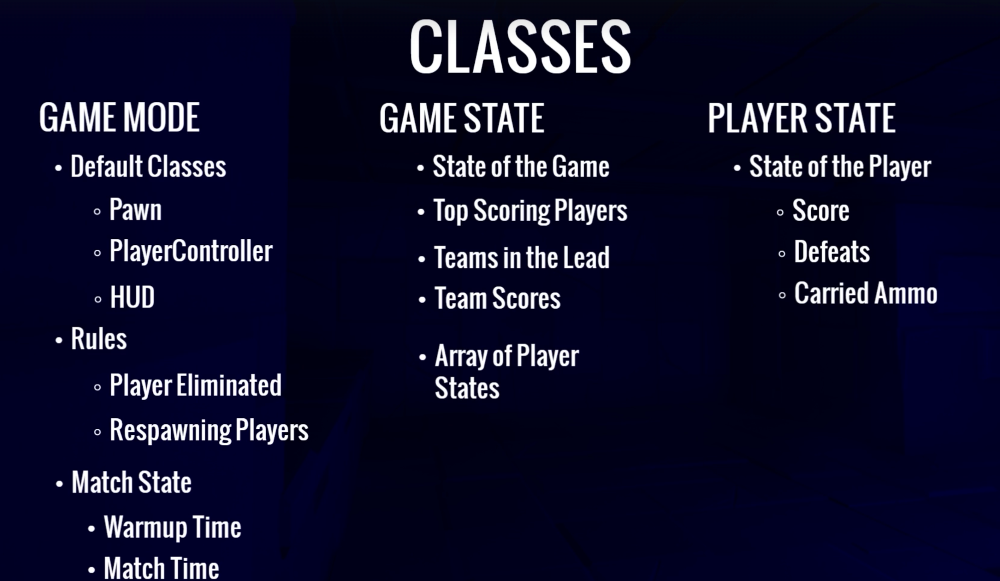

# UE5-MultiplayerShooter
## 开发日记：
---
## 一、项目创建
### 1. 加入插件

### 2. 资源导入

### 3. 动画重定向
使用骨骼约束系统（IK Rig）和骨骼重定向器（IK Retargeter）

### 4. 角色创建
移动方向：
- pitch：绕x轴（俯仰）
- yaw：绕z轴（左右方向旋转）
- roll：绕y轴（竖直方向旋转）

### 5. 角色动画

### 6. 无缝传送和大厅
1) Non-Seamless Travel(非无缝传送)：客户端从服务器端断开连接，客户端重连至相同服务器。发生情况：第一次加载地图，第一次连接至服务器，当结束或开始一个多人游戏。  
2) Seamless Travel（无缝切换）：客户端无需从服务器断开连接，避免了重联时遇到的网络问题，更加丝滑。在`Game Mode`中启用，需要一个transition map，这个地图需要已经被加载完成（这样就省去了同时存在两张大地图的资源消耗）。 

### 7. 网络角色
分别有以下几种不同的网络角色：
- `ENetRole::ROLE_Authority`: 服务器上的权威角色
- `ENetRole::ROLE_SimulatedProxy`: 客户端上看到的其他玩家控制的角色
- `ENetRole::ROLE_AutonomousProxy`: 自己客户端上可控制的角色
- `ENetRole::ROLE_None`: 没有定义角色的actor

local role和remote role的区别：
- local role：在客户端上显示的为控制的角色为`Autonomous`和其他客户端上的角色`Simulated`；而在服务器端角色显示都为`Authority`
- remote role：在客户端上显示的为在服务器端的网络角色即`Authority`；而在服务器端则显示控制的角色为`Autonomous`和相应的`Simulated`

## 二、武器
### 1. 创建武器类

### 2. 拾取武器显示

### 3. 武器复制变量
在网络系统中注册了可复制的变量，解决了只能在服务端显示拾取武器控件的问题，能通过服务端复制武器到客户端，使用`DOREPLIFETIME_CONDITION`来限制只在有所有权的服务端或客户端复制武器，其他客户端不会同步该武器。  
并且通过委托函数（通过宏设置`ReplicatedUsing`）来触发回调函数`OnRep_`（里面能够通过参数保存原属性的旧值）来设置人物与武器重叠时的拾取武器控件的显示与关闭。

### 4. 装备武器
- 使用了Actor Component来创建一个在人物角色上的新组件用来装备武器
- 为`CombatComponent`添加人物角色的友元类以将所有访问权限暴露给角色类
- 在多个类中为了获取私有变量，创建内联函数`FORCEINLINE`的get或set函数来减少性能开销。在内联函数中，函数体的代码被肢解插入到调用该函数的地方，因此不需要进行函数调用的相关开销，如压栈、跳转、返回值处理等。相比于函数调用，内联函数的执行速度更快。

### 5. 远程过程调用（RPC）
1) Remote Procedure Call是指在客户端和服务器之间发送函数调用消息的机制。当客户端需要通知服务器执行某个函数时，客户端可以通过RPC将函数调用消息发送给服务器，并在服务器上执行该函数；服务器同理。  
2) RPC分为可靠的与不可靠的：
   - 可靠：确保RPC调用被成功接收并处理，如果网络出现问题会尝试重传RPC调用，直到成功处理。基于TCP协议，保证了数据的可靠性和正确性，比如玩家角色位置的同步
   - 不可靠：可能会在网络中被丢失。基于UDP协议，用于快速传输RPC调用，但不保证数据的可靠性和正确性；可能会出现数据丢失或顺序错乱等问题，比如玩家角色的伤害计算
3) 在UE中，对于声明了RPC的函数，需要在其后面添加一个函数名为原函数名+`_Implementation`的实现函数，用于处理服务器上实际执行该RPC所需的逻辑。这样设计的原因是：RPC系统基于反射机制（在程序运行时动态调用函数）实现的，使得RPC函数的调用和实现可以分离，从而更好的实现了代码解耦性和可维护性。
4) 通过将变量设置为replicated，如果这个变量在服务端**发生改变**（如果没有发生变化则不起作用）并设置为true，在客户端上会被复制也设置为true，此时调用Rep_Notify可以在所有客户端上复刻服务端上的动作。

### 6. 装备武器动画姿势
因为上面仅在服务器端给武器类中的EquippedWeapon赋值了，客户端中的依然为null，这时就需要给武器类中的EquippedWeapon也设置为Replicated。  
一旦涉及这个过程都需要为该变量加上`UPROPERTY(Replicated)`，并重写`GetLifetimeReplicatedProps`虚函数。

### 7. 下蹲
UE中自带Crouch和UnCrouch内置函数（考虑了多人在线游戏因素），这个内置函数中`bIsCrouched`变量是可复制的所以可以复制到所有客户端，并且还实现了如**重置胶囊体**和移动速度切换等，大大减少了重复造轮子的时间。

Tilde符号即~，可以用作运行游戏时打开控制台的快捷键；能够查看和修改游戏状态，执行各种命令（如添加物体，碰撞检测等）

### 8. 瞄准
在`CombatComponent`中把诸如`EquippedWeapon`, `bAiming`等变量都设置为`Replicated`；这些属性将被自动在客户端上复制，从而实现服务器与客户端之间的同步。这里使用`ServerSetAiming`作为RPC会在客户端上调用服务器上的函数，服务器将更该应用于自己的状态并分发给所有已连接的客户端进行同步，因为该函数被标记为了`Server Reliable`所以只有服务器可以调用它并建立可靠的RPC服务。

>计算旋转偏移Yaw Offset过程：
1) 获取角色的基础瞄准旋转（Base Aim Rotation），即没有偏移时的瞄准旋转；
2) 获取角色的运动方向，通常是角色的速度向量，然后将其转换为一个旋转矢量；
3) 计算角色的运动方向与瞄准方向之间的旋转差（Delta Rotation）；
4) 将旋转差转换为一个浮点数值，通常是旋转差的Yaw轴（水平旋转轴）分量；
5) 使用差值算法（如线性插值或插值函数）逐渐调整Yaw Offset的值，使其向目标值靠近。

如：当玩家瞄准时，游戏会计算出身体需要旋转的角度，然后将这个角度缓慢地应用到角色的旋转中。这样，身体的旋转速度就可以逐渐与头部的旋转速度同步，从而保证射击时枪口不会偏离目标。  
在第三人称射击游戏中，角色的枪口和准心通常不在同一位置，而且准心的位置通常是固定的，不会随着角色的移动而变化。另外，角色身体的旋转和移动方向通常也不是完全与准心对齐的，这就导致了准心和角色的瞄准方向存在差异。为了让玩家能够更准确地瞄准，需要通过瞄准偏移来修正这种差异，让准心与实际瞄准方向对齐。

### 9. 横向移动以及身体倾斜
通过旋转root角度制作lean的动画，在混合空间blendspace中填入。  
为了配合身体的旋转，需要在服务端和客户端均禁用`OrientationRoration`（使用了RepNotify）  
计算身体倾斜lean时，记录了上一帧角色朝向，通过与当前帧的角色朝向的差值计算出朝向的变化率，即每秒的旋转角度；接着通过插值（Interpolation）计算出当前帧的身体倾斜状态并将其限制在-90到90度之间。对于横向则使用了`RInterpTo`使其有一个平滑的过渡。

### 10. 瞄准偏移
当人物处于装备武器站立状态时，此时人物上半身瞄准状态应该跟随鼠标移动，而下半身应保持静止状态。  
>当客户端发送Pitch（水平方向的旋转即俯仰视，限制在了-90到90度之间）到服务端时或服务器分发给客户端时，需要经过一个函数将角度压缩成size更小的short类型；因此负角度就会转换成[0->360)的度数，再通过与0xFFFF比特相与映射到[0->65536)，再传到服务器或其他客户端时再解压缩到[0->360)之间的度数，这就会造成当人物俯视时在其他客户端显示为仰视。

使用了Cashed Pose来分别存储我们装备武器后的身体以及瞄准姿态时的身体，使用layered blend按照spine_01将身体的上下部分分开；使用缓存姿势时，可以利用已经存在的动画资源，并通过设置适当的姿势转换规则来动态地生成动画，从而提高运行效率。另外，Cached Pose还支持在多个线程上进行计算，从而进一步提高效率。

**FABRIK IK（反向运动学）**，以使角色的左手到左肩这一部分（Solver）根据末端执行器右手（已Attachment绑定武器的transform以骨骼为参考系）能够自然地移动并正确地与手持枪械处于正确位置。在 Fabric IK 中，可以根据 end effector 的位置来调整 IK solver 的目标位置，以便更好地适应角色的运动和变化。 

### 11. 人物静止持枪旋转
新建了一个头文件专门存储转动的枚举类型，分别为：向左转，向右转，不转。为了使枪口方向在旋转90度过后角色跟随旋转；新建了一个插值InterpAO_Yaw，当它不断趋近于0度时，在小于一定阈值时使人物平滑过渡并不再处于旋转状态。

### 12. 网络更新频率
在进行多客户端测试时会发现，当在其他非控制客户端显示角色动画时，会产生抖动问题，解决方法：
- 针对人物骨骼旋转的Clamp中开启Interp Result，将旋转结果限制在一定范围内，避免角度值过大或过小出现不合理旋转效果
- 设置角色的网络更新频率（常用值为66）和最小网络更新频率（常用值为33）
- 更改配置文件中的DefaultEngine，设置NetServerMaxTickRate = 60

### 13. 添加脚步声和跳跃音效
在行走动画上添加Notify Track，使用Sound Notifies可以在所有客户端上的角色正常同步运行。  
使用Notify Sound Sync用来创建同步声音事件，用于处理网络同步音频问题。  
同时给动画帧数上添加音效时需注意按总长规律添加，否则重复循环播放会造成音画不同步问题。

## 三、武器开火
### 1. 武器开火类别
Projectile vs Hitscan：  
投射物攻击方式：
- 发射一个投掷物projectile
- 有一个速度
- 有/没有重力（榴弹炮或火箭筒）
- 碰撞事件
- tracer particles轨迹粒子

射线追踪方式：
- line trace射线追踪
- 即时命中
- Beam particles光束粒子

### 2. 开火动画
为每个开火动画加上additive animation，为了在原有动画姿势和骨骼不变的情况下播放开火动画。

### 3. 实现多客户端实现开火效果
如果单单使用Server RPC只会在服务器上实现开火效果，而不会分发到各客户端上；这是因为之前通过Server RPC实现的服务器分发客户端效果使用了Replicated变量的效果，但Replicated变量只有在发生改变的时候才会成功复制到各客户端上，然而如果我们想实现自动开火即bFireButtonPressed一直为true，则它不会复制到各个客户端上，只会在服务端显示。  
此时引进了**NetMulticast**这个RPC通信技术，当它在服务端被触发时，会分发到服务端以及所有客户端上，很好的并且十分简洁的帮我们实现了网络传递的效果；但如果它在客户端被触发则仅会在被触发的客户端上实现，所以需要借用一层ServerFire函数使其先在服务端上被触发。

### 4. 命中目标
新建了一个私有变量HitTarget，通过TraceUnderCrosshairs为其赋值。设置viewport位置屏幕中央转换为world世界坐标系后通过linetrance设置HitTarget。

### 5. 实现多客户端命中事件
由于RPC调用需要占用网络带宽，我们不能为所有的replicated变量做RPC调用，此时需要采用其他更为高效的办法；这时我们发现Destroy()函数里实现了广播效果，所以在重写后的Destroy()函数中加入命中产生的例子效果和音效，在里面实现服务端到所有客户端的传递。

### 6. 子弹壳类
为每个武器添加统一子弹壳名的socket，在总weapon类中添加sub子弹壳变量，为了给继承总武器类的不同的枪械配置不同的弹壳类。相当于简易版的开火flash socket实现。

需要设置弹壳与摄像机的碰撞为Ignore，否则会产生镜头与弹壳碰撞畸变问题  
同样需要设置Hit Event（蓝图中的命名与C++中不同）

弹壳掉落声音：设置音效attenuation回声的inner radius为200（播放全部声音），falloff distance为1500指声音传播的距离，当距离超过该值时，声音的音量和衰减程度会逐渐减小，直至听不到为止。

## 四、武器瞄准机制
### 1. HUD和player controller
新建玩家控制类和HUD类；  
HUD类中存在`DrawHUD()`函数，会被每帧调用，在这里画十字瞄准线。十字瞄准线的texture写在weapon类中：上下左右（横线竖线）以及中心（一个点）；  
创建HUD类对应的蓝图，并在GameMode添加；  
创建Controller类对应的蓝图，并在GameMode中添加；  
在HUD类中创建一个集合了五个材质的十字瞄准线结构体，并将其设置为HUD类的私有变量并创建对应的set函数；  
在Combat组件中加入设置十字瞄准线的函数，并传入deltatime因为要设置interpolation，并在tick函数中调用了该函数；  
在Combat组件类中加入hud类和controller类成员；  
在获取到controller的hud后，如果有EquippedWeapon，设置十字瞄准线结构体的五个变量为装备武器中存储的对应瞄准线texture，否则置空；  
调用HUD类自己的set瞄准线函数。

### 2. 将十字瞄准线显示到视图上
因为一共要画五个图像，添加一个DrawCrosshair函数供每个图像调用设置到屏幕中心位置；设置瞄准点的位置时要注意减去原材质的一半长度，并调用Texture画到中心点的位置（包含多个参数）

在计算机图形学中，纹理坐标通常使用U和V表示。它们是二维坐标系，用于定位纹理图像上的特定像素或纹理区域。
- U坐标（也称为水平坐标）表示纹理图像中的水平位置。它的范围通常从0到1，其中0表示纹理的左边缘，1表示纹理的右边缘。
- V坐标（也称为垂直坐标）表示纹理图像中的垂直位置。它的范围通常从0到1，其中0表示纹理的上边缘，1表示纹理的下边缘。

### 3. 设置瞄准线发散效果
在HUD类中的FHUD结构体中添加spread的浮点型变量，但传入draw函数的时候需要FVector2D变量，因为我们发散的度数一样的，但是方向正负不同；  
创建一个成员变量MaxSpread暴露给蓝图更方便调整扩散大小，传入draw函数是为五个图像设置不同的Spread参数；  
在这里FVector2D的UV坐标系向上是y的负方向；  
在Combat组件中设置FHUD结构体中添加spread的浮点型变量的值，一般扩散大小与人物速度动态相关，所以我们需要将人物速度（0-600）映射到0-1的区间内；  
为十字瞄准扩散大小再新增一个在空中时的控制变量与前者相加，这个空中spread使用interpolate让它平滑缓慢的扩散到指定大小

### 4. 纠正武器瞄准位置与中心点不一致问题
通过右手的socket位置与hittarget的目标点位置得到右手的旋转角度（因为x轴方向相反需要调整为相反方向）；  
在动画蓝图中使用右手旋转角度，调整fabric位置；  
为了减少带宽 消耗，我们不需要使每个机器上都有这个旋转角度，只需保证控制主机使用该旋转角度对准即可；  
为了使动画蓝图中也保证本地控制，需要在动画实例类文件中添加bool变量判断，而不能在蓝图中直接使用is locally controlled（线程不安全）；  
解决bug：枪口方向错乱，因为射线射向远处如天空时没有碰撞点，所以需要加入block碰撞判断，直接设置ImpactPoint为终点

### 5. 不同武器的瞄准放大
在武器类和Combat组件类中分别设定Zoom的大小，和Zoom的速度；  
需要通过摄像机得到默认的以及当前的视野范围，并且设置摄像机的FOV；  
设置默认状态下的FOV和当前状态下的FOV，通过是否瞄准的bool变量来设置FOV的值；  
针对不同的武器我们可以设置不同的FOV（比如步枪和狙击枪）；
但是当镜头拉近时会造成模糊背景的问题，此时需要增大摄像机的景深（DOF），并增大F-stop以减小光圈大小产生较大的景深，使图像整体保持清晰

### 6. 瞄准时准星收缩以及射击时准星扩散
在Combat组件类中再添加一个浮点型aim因子，在计算瞄准spread时加上该变量，为防止收缩成0加上一个基准值；  
添加浮点型shoot因子，在开火函数时设置改值，并且要interpolate该值到0再加到spread变量中，因为射击时准星扩散后应马上回到原始值

### 7. 改变准星颜色
为了使在命中目标时准星颜色变红，我们需要让人物类继承自Interface类；  
在FHUD结构体中添加颜色变量，将HUD添加为成员变量，为了在UnderTrace函数中使用并且给颜色赋值；  
在人物类中设置与Visibility的碰撞检测为block；  
因为从远处转移到目标人物时hittarget突然变近会导致右手突然旋转以对准枪口方向，此时我们需要为其添加interpolation

### 8. 延伸射线
解决bug：其他角色遮挡摄像头时准星瞄准导致枪口倾斜准星变红以及靠墙时人物自己遮挡视角。  
因为射线是从摄像头中心射出的，会与角色产生碰撞，所以此时我们将射线的起始射出位置加上一段距离就可以防止其他角色的遮挡碰撞；  
添加隐藏摄像头函数，并在Tick函数中调用，判断当摄像头与人物间隔小于一定阈值时隐藏人物以及人物装备的武器

### 9. 击中目标
添加四种不同方向的受击动画（additive animation），创建对应的蒙太奇动画，在projectile类的hit函数中加入人物类的播放受击蒙太奇动画，改变人物pawn与projectile的碰撞检测为blcok，并在动画蓝图中加上hit的slot；  
为播放受击蒙太奇动画使用Multicast RPC实现服务端向客户端的传递，但是这个RPC是Unreliable的（只有在高延迟情况下会被扔掉），因为受击动画并不重要；  
新建一个collision object，用来专门描述人物的mesh碰撞体（因为原来的碰撞是靠capsule的，可能以后会造成碰撞检测不准确），这个新建的变量会占用ECC_GameTraceChannel1的位置，在Blaster类中define这个变量；  
这不会造成太多更多的消耗，因为我们瞄准的是物理模型而不是多边形。网格描述了物体的外观和形状，而物理资产用于模拟物体的物理和碰撞行为。 

### 10. 优化代理客户端上的旋转动画
！其他客户端上的旋转动画会出现抖动问题，这是因为动画蓝图的更新并不是每帧更新的而是跟随网络所更新的，所以会比tick慢一些；  
在C++中，enum其实是有整数索引的列表，所以越靠前定义的变量它越小，这时我们可以通过LocalRole > ENetRole::ROLE_SimulatedProxy来区分服务器、本地客户端与其他客户端；  
这样我们新建一个bool型的旋转root变量供人物角色和人物蓝图使用，当在本地的时候使它变为true而在其他客户端时为false；  
由于代理客户端同样也是tick每帧更新的，此时通过服务器传递的网络更新并没有tick更新快所以会出现yaw不断更新为0的情况，这时我们便需要通过replicated和notify进行网络传递；  
因为这个replicated movement变量只有在当角色移动时才会触发notify调用旋转函数，为了让角色站定状态下仍然能够旋转，我们加入一个时间阈值变量在tick中，当大于一定时间后就会触发旋转函数；  
在速度大于0即移动过程时，需要提前判断设置为不旋转状态并提前返回

### 11. 自动开火
在Combat组件类中设置开始和结束的开火时间函数，对于非自动开火武器使用bCanFire控制**连续点击鼠标状态下**的开火间隔时间（FireDelay）；  
在武器类中加入FireDelay，bAutomatic等变量

### 12. Option
增加了不同的击中粒子效果，通过一个新创建的粒子变量来在每一次命中玩家角色时选赋值特定的例子效果变量即可；  
增加了新的十字瞄准判断因子，当瞄准玩家角色时会适当收缩准星，通过TraceHitResult的值判断是否与角色所继承的接口相等来设置，并加入到总的CrosshairSpread；

## 五、人物生命和状态
### 1. 游戏框架
- GameMode：仅在服务器上
- GameState：在服务器和所有客户端上
- PlayerState：在服务器和所有客户端上
- PlayerController：服务器和自己的客户端
- Pawn：服务器和所有的客户端
- HUD/Widgets：仅在自己的客户端上

PlayerController负责HUD的功能

在服务器和客户端上的分布：

### 2. 人物血量
在character类中而不是PlayerState里添加health，这是因为PlayerState是较慢的网络更新，而character有快速的replication；  
在character类中添加health为replicated变量并添加notify函数；  
创建新的health widget，在谷歌fonts中下载新字体，放在progress bar上；  
新建CharacterOverlay的类，并在其中添加与widget蓝图相同的变量，并在BlasterHUD中加上CharacterOverlay（用于添加到viewport中，并且这个是widget蓝图的父类）和CharacterOverlayClass（用于蓝图中添加，因为创建widget需要UClass）  
需要通过playerController来创建widget

### 3. 更新血量
使用PlayerController来访问HUD，直接使用GetHUD()就能访问到HUD；  
然后在character类中使用PlayerController来更新血量；

### 4. 伤害
新建ProjectileBullet类继承自Projectile类，并在其中重写OnHit函数事件；  
因为这里的health变量是replicated的，我们在它的notify函数中调用播放受击伤害动画而不再通过multicast RPC，更加减少网络带宽的使用；  
使用OnTakeAnyDamage来动态调用ReceiveDamage函数

### 5. Game Mode
新建继承自GameMode的类，在其中重写玩家角色被销毁的函数；  
在character类中添加Elim函数；  
在character类的ReceiveDamage函数中添加判断，当角色生命值为0时我们调用GameMode中玩家被销毁的函数，其中的参数分别是：玩家对象，受击的玩家controller，攻击的玩家controller（即character类中的instigator）

### 6. 死亡动画
使用飞升动画来创建死亡动画蒙太奇，营造一种溶解的感觉；  
在Elim函数中播放动画，并设置bool值isElimed供动画蓝图类使用；  
为了使所有客户端都播放死亡动画，需要使用Multicast RPC，并且因为该信息比较重要，需要设置成reliable

### 7. 复活 
将Elim与MulticastElim分开写，因为我们需要仅在服务端实现一些功能，比如GameMode（因为GameMode仅在服务器上调用）的计时；  
新增ElimTimer的计时器，并在Elim函数中进行设置；  
在GameMode中重写RequstRespawn函数；  
在计时器的回调函数中调用ElimFinished函数，在其中调用GameMode中的Respawn函数（仅在服务端上）， 使用playerstart的位置来重生人物；  
目前并没有处理人物拾取武器死亡重生后，武器仍在人物死亡位置的问题；  
如果出生点相近产生碰撞会导致无法重生，需要调整Spawn设置

### 8. 溶解效果
创建溶解的材质，创建Curve（蓝图中的timeline）；  
其中Curve的插值就是Dissolve的值；   
在使用静态材质时，其属性和参数是在编辑器中设置的，并在运行时保持不变。这意味着无法在运行时动态地修改静态材质的属性，如颜色、纹理、透明度等。如果需要在运行时对材质进行修改，就需要使用动态材质实例。

### 9. 死亡禁用人物状态
在玩家角色被消灭时，我们需要禁用他的移动，碰撞体以及丢掉持有武器；  
`DisableMovement`函数会禁用角色wasd的移动，`StopMovementImmediately`函数会禁用角色的旋转；  
玩家的碰撞和重叠检测，一般的做法是在服务器端进行判断并执行相应的逻辑，而在客户端上进行视觉效果的表现和反馈（比如显示widget）

### 10. 死亡飞船
zapsplat：声音网站，Convertio：MP3转WAV网站；  
为了让飞船动画播完后在所有客户端消失，需要再次重写Destroy函数，并把销毁飞船组件的代码写在重写的Destroy函数中，像projectile一样；  

### 11. 解决重生后生命值为0的问题
在PlayerController中重写OnPossess函数，可以通过这个函数让我们在角色重生时更新生命值；  
使用`UE_LOG(LogTemp, Warning, TEXT("..."))`来Debug

### 12. PlayerState
在UE中，PlayerState 类是用于表示玩家状态的类，它通常用于存储与玩家相关的信息，如分数、生命值、经验等；  
在PlayerState中持久记录玩家角色的状态；  
PlayerController可以直接访问到PlayerState，反之不行，但是可以通过Pawn得到Character再关联到Controller通过Cast得到；  
PlayerState中有内置的score变量并且是replicated的，重写已经内置的score的notify函数，添加角色类和角色控制类；  
为了确保服务端和客户端都能更新score，服务端需要单独一份函数来更新score，因为score是replicated的，它会调用Notify函数传播到所有客户端进行更新；  
为了使玩家死亡后不会重置击杀分数，我们需要保存玩家的状态，而且因为PlayerState在玩家出生后的一到两帧后才会初始化，所以需要在Tick函数中轮询初始化PlayerState才能够成功设置Score分数的值；  
PlayerState 对象的初始化通常是在玩家连接到游戏服务器后进行的，而不是在第一帧时立即初始化。因此，在编写游戏逻辑时，应考虑 PlayerState 对象的初始化和同步时机，并在需要使用 PlayerState 信息时进行适当的处理

### 13. 被击杀数
与得分基本同理，但是并没有内置的replicated的defeats变量，需要自己创建，加入Lifetime并实现回掉函数；  
在GameMode的Elimated函数中调用PlayerState的更新分数和死亡数；  
UPROPERTY宏可以防止未初始化，即指针为未定义的值，因为在if判断指针条件时，如果未初始化可能会被传递一个未知的初始化字母因为它不是空指针；  
bug：在被击杀数到达1时，再进入增加击杀数函数时，Character->Controller为空，删除了这个判断条件

## 六、子弹
### 1. 武器子弹
子弹是非常重要的一个属性，应该仅让服务器进行管理；  
为了同步服务端和客户端的武器子弹，同样需要使用replicated进行网络传递，能够保证一个玩家丢掉武器时，另一个玩家拾取该武器显示的子弹为剩下的子弹数；  
在Fire函数的最后添加消耗子弹函数；  
因为在武器类中，继承自Actor类，需要通过`GetOwner()`来获得Character，所以在设置HUD前需要确保Owner已经正确设置，所以客户端的HUD要设置在Owner的Notify函数中；    
因为我们无法确定是owner还是武器状态先被复制到网络中，所以需要重写owner的notify回调函数，在里面添加子弹数的初始化状态；  
解决能同时捡起多个武器的问题，在Equip函数中添加判断，如果持有武器了，那么就调用Drop函数；  
需要注意在人物被消灭后，仍然需要重置子弹数的HUD为0；  
在Combat组件类中新建CanFire函数，判断条件为子弹数是否大于0和bCanFire是否为true，并且使用Clamp将子弹数控制到0 - 弹夹最大容量；

### 2. 武器总子弹数
新建武器类型的枚举数据，将它放到单独的一个头文件中，在Combat组件类中引入这个头文件，并定义TMap数值对类型（武器类型：携带子弹数）；  
注意尽管我们只需要在服务端上验证伤害和命中事件，但是我们需要ammo是relicated的，因为要传播到客户端上更新子弹的HUD

### 3. 换弹
为每个特定的武器提供不同的换单姿势，需要创建新的动画蒙太奇，这里先设置Rifle为第一个section；  
如果我们在客户端上，我们需要向服务端发送RPC，在服务端上确认是否能换弹并播放换弹动画；  
在换弹时我们需要禁用左手动作的FABRIK让它不会固定在枪上，所以在一个新的头文件中创建`CombatState`的枚举变量，其中有换弹状态`Reload`和未被占用状态`Unoccupied`，当切换到换弹状态时就禁用FABRIK，换弹完毕时需切回未被占用状态；  
为了防止状态只改变一次，仅仅只能传递一次RPC，我们可以在换弹动画蒙太奇中加上notify来通知换弹结束，可切换状态；  
如果没有在CanFire函数中加入判断，我们在换弹时点击开火就会中断换弹动画，导致无法到换弹结束notify中切换状态；  
为了防止状态切换时还没从服务端传到客户端，无法在MulticastFire中实现开火动画蒙太奇，我们在Combat的Notify函数中加入判断，如果开火键被按住则调用Fire函数；  
为了正确更新子弹数量，所用的数据公式为：补充的子弹数 = Clamp(0, Min(弹夹数减去子弹数量，剩余总子弹数))；  
在换弹动画结束后再更新子弹数量；  

### 4. 换弹效果
添加换弹效果，音效，装备武器音效，并在换弹时禁用其他动画如瞄准；  
在开火结束时和装备武器时加入判断是否字段为空然后自动换弹

## 七、匹配状态
### 1. 匹配等待时间
加入计时器HUD显示状态，显示的形式需要使用`%02d:%02d`进行格式化，为了使其每秒更新而不是每帧更新，加入一个uint32类型判断，使其在每个整数秒后在tick中更新；

**同步服务端和客户端的时间**：由于每个客户端启动游戏的时间都不一定相同，导致服务端的时间与客户端上显示的时间不同，需要通过网络间传递RPC来获得服务器上的权威时间并减去往返RPC的时间（RTT往返时间）；  
我们需要创建两个RPC，一个为从客户端发送到服务端上（Server RPC），一个为从服务端返回到客户端（Client RPC）：
- 服务端接收到的是客户端发送请求的时间，
- 将客户端发送请求的时间和服务器所在的时间一并发送到客户端上，
- 客户端收到服务端发送的客户端发送请求的时间减去自身的时间得到RTT（Round Trip Time），
- 客户端收到服务端回复的当前时间加上一半的RTT（一次RPC的时间）为当钱服务端时间，
- 而当前服务端与客户端的网络延迟则为求得的当前服务端时间减去现在客户端上的时间，
- 我们计算出这个网络延迟变量（ClientServerDelta为正值，调用GetSeconds启动越早时间越长，所以客户端的启动时间是小于服务端的）后，每次获取服务器时间时，如果在服务器上直接返回当前时间；如果在客户端上，则用当前客户端时间加上该网络时延即可

通过重写`ReceivedPlayer`可以在很早的时候就被调用来设置网络延迟变量，为了更好的减少误差，我们在Tick函数中加入判断，每五秒就执行一次同步时间；

### 2. Game Mode Base vs. Game Mode
GMB的功能包括一些默认类，玩家的初始化，重生玩家重启游戏等；  但继承自GMB的GM除了以上功能外还包括Match State；
  
当我们设置`bDelayedStart=true`时GameMode会停留在WaitingToStart状态知道我们手动调用`StartMatch`函数来转换到InProgress状态来初始化玩家角色；  
添加游戏热身时间（进入主地图后的warm up），需要在GameMode中的BeginPlay获得关卡开启时间，因为在Tick函数中获得的时间为整个游戏启动时间（即从主菜单开始），需要加上主关卡（Blaster）开启时间（LevelStartTime）获得正确时间；  
在PlayerController中添加MtachState为replicated的变量，并添加Notify函数传播到客户端上；  
在GameMode中重写OnMatchStateSet函数，并在其中通过FConstPlayerControllerIterator来循环遍历所有的PlayerController；  
当游戏状态切换到InProgress后，显示人物的HUD，将显示HUD的功能同步添加到RepNotify函数当中；  
我们需要在HUD被创建显示之前，设置HUD的一些值比如生命值和击杀数等，因为他们在PlayerController中设置时是需要先确保Overlay实例化出来的，所以当实例化不成功时，我们将这些值初始化以免无法显示（我们把添加CharacterOverlay的函数从BlasterHUD的
BeginPlay函数中删除，在PlayerController的状态切换时添加CharacterOverlay）；  
我们可以将CharacterOverlay挂载在PlayerController上，然后通过PollInit函数判断是否已将Overlay初始化；  
缓存HUDHealth和HUDDefeates等变量，确保在CharacterOverlay一实例化成功后就能设置好这些值；  

### 3. Warm up界面显示
在匹配状态为WaitingToStart时我们要调出热身HUD显示；  
为了在结束游戏时重用该widget为通知胜利者的HUD，所以当匹配状态切换为InProgress时我们将该widget隐藏；  
将Warmup Time，MatchTime，LevelStartTime都放在GameMode当中：
- Warmup Time：热身时长
- MatchTime：匹配时长
- LevelStartTime：Blaster关卡启动开始的时间
- GetSeverTime()：服务器上的时间（游戏启动开始时的运行时间加上服务器到客户端的网络时延）
- TimeLeft：Warmup Time + MatchTime - GetSeverTime() + LevelStartTime
通过Server RPC和Client RPC设置上述变量，使用Client RPC是因为只需要将这些变量传递一次；

### 4. Cool down界面
当Cool down时间结束时，我们重启整个游戏；  
在冷却时间时，我们禁用一些运动比如：跳跃、射击、爬行、瞄准等，但我们仍然允许玩家通过旋转controller旋转摄像头（但不会影响角色旋转），在重启时同样删除武器；  
通过在人物类中添加bool变量bDisableGameplay（是replicated的）来控制是否禁用，在需要禁用的输入函数中加上该布尔类型的判断，我们希望在CoolDown时间时只允许玩家旋转摄像头视角；

### 5. Game State
我们用Game State来记录得分最高的玩家数组（因为可能是多人并列），这个数组同样是replicated，因为需要传播到客户端显示在widget中；  
if else判断如下：
- 若TopPlayers数组中数量为0，则显示没有赢家，
- 若TopPlayers数组中数量为1且数组中的第一个元素为自身PlayerState，则显示你是赢家，
- 若TopPlayers数组中数量为1，则表明赢家是其他客户端上的玩家而不是自己，显示该玩家的名字，
- 若TopPlayers数组中数量为0，则循环遍历数组中的元素，依次将玩家名字显示在屏幕上

## 八、新增武器
### 1. 火箭子弹类
新建继承自Projectile父类的子类ProjectileRocket，重写其中的OnHit函数；  
更改伤害函数为ApplayRadial，可以设置范围伤害，并设置内圈和外圈的不同伤害大小，实现线性伤害衰减；  
在ProjectileRocket类中创建RocketMesh变量，并在AProjectileRocket中进行初始化；  
新建继承自武器类的Rocket蓝图，在里面设置Mesh，Areasphere，pickup widget，Speed等变量，更改左手的leftSocket位置；  
在WeaponType中添加新的枚举类型Rocket，并在组件类创建新的Rocket起始弹夹数量，为了放置到CarriedAmmoMap中；

### 2. 火箭箭尾轨迹
创建箭尾轨迹的粒子系统FX；  
需要在Build文件中加上`Niagara`这个模块；  
因为需要调用父类Projectile中的ImpactParticles和ImpactSound变量，需要将它们从私有类中转移到保护类，这样子类可以直接访问到该变量；  
火箭子弹类中添写销毁时间定时器，`TrailSystem`粒子系统和`ProjectileLoop`声音系统的类和对应**组件类**（用于手动销毁）；  
因为伤害计算都在服务器上判断，原父类Projectile的OnHit函数仅在服务器上调用，但我们在子类ProjectileRocket中想让客户端调用OnHit函数，因为要触发当中的粒子效果和音效（原来父类的OnHit函数仅调用Destroy函数来在销毁时触发效果），而这里我们想让火箭弹命中目标时就播放粒子效果而不是销毁后，这里的定时器是为了使绑定在火箭弹上的箭尾轨迹不会随着碰撞直接消失而是在定时器的规定时间内缓慢消失；  
所以这边重写了Destroyed()函数但不做任何操作；

### 3. 子弹移动组件
火箭弹会存在与发射火箭弹的所有者碰撞的问题，但我们不能直接在Projectile的BeginPlay中直接Ignore特定的Actor，因为碰撞发生的太早了代码无法执行到这一步就爆炸了哈哈；  
Projectile的移动组件设定是当触发碰撞时会停止移动，所以不能单单在OnHit中判断是否命中自己，因为我们想让火箭弹即使与自己碰撞也要继续向前移动，这时我们可以制作自己的Projectile Movement Component；  
有些开发者可能会把在火箭发射器的socket向前移动一些来避免碰撞，但这并不专业；  
我们想让Projectile Movement Component在检测到Hit碰撞时继续向前移动而不是停止（即便是检测与自己碰撞的情况），所以要让移动组件检测到碰撞时继续向前移动，只用它的collision box碰撞体来做OnHit碰撞检测判断；

### 4. 射线武器类
与投掷物武器类一样同样继承于武器AWeapon类，但不同的是投掷武器类仅重写了父类的Fire函数，并且拥有`TSubclassOf<Projectile>`的私有子类，在Fire函数触发时会在世界中生成投掷物，其他的比如伤害，碰撞粒子效果和音效等都存放在类Projectile自己的类当中；而射线武器类则自己带有伤害和粒子效果音效等子类；  
通过在Fire函数中调用LineTrace来给FHitResult赋值，通过这个Hit结果检测是否是人物Actor来计算伤害并播放粒子效果等；

### 5. 射线粒子
从MuzzleFlashSocket为起始点射出，设置射线的命中终点为：起始点 + (命中目标点 - 起始点)*1.25f，来确保射线能够正确的穿过目标点产生碰撞；
如果FireHit产生了与碰撞就将Beam的终点设置为该碰撞点，并将碰撞点设置在Beam粒子系统上的`Target`上即可播放粒子效果；

### 6. 冲锋枪
在`WeaponType`枚举中新增冲锋枪类型；  
在`CombatComponent`中的携带子弹TMap中新增键值对：（冲锋枪，起始携带子弹数）；  
在`BlasterCharacter`中的换弹蒙太奇切换代码中添加冲锋枪的case判断并跳到对应的换弹Section Name；  
这里因为冲锋枪的开火动画中没有自带射击声音和开火动画，我们需要在`HitScanWeapon`类中自行添加对应变量并在Fire函数中进行播放；  
在冲锋枪的物理材质中调整AmmoEject的位置以及添加LeftHandSocket；  
为了模拟冲锋枪前面带子的物理效果，我们为其带子骨骼添加胶囊体，并开启他的碰撞检测和重力效果；

### 7. 霰弹枪
加入霰弹枪的初始步骤与上述冲锋枪相同；  
在`HitScanWeapon`类中加入`TraceEndWithScatter`来获取每个射线点的终点位置；  
- 使用`ToTargetNormalized`归一化可以得到从 TraceStart 到 HitTarget 的单位向量，即方向 
- 目标位置中心点为：TraceStart起点 + 一段固定距离 * 归一化后方向上的单位向量，
- 设置随机向量的方向为：随机单位向量 * 范围区间（0到设置的固定半径）相当于一个圆球中的随机点，
- 终点位置即为圆心 + 随机向量，
- 起点到终点的这段距离即为：终点位置 - 射线起点位置，
- 返回值为：`FVector(TraceStart + ToEndLoc * TRACE_LENGTH / ToEndLoc.Size())`避免射线长度值太大造成浮点数值溢出我们这里除以一个自己的size；

创建`TMap<ABlasterCharacter*, uint32> HitMap`临时变量用来存放命中的玩家和累积的子弹数；  
在`Shotgun`类中的Fire函数里遍历循环一个霰弹枪可以打出的子弹数（比如十二个），每命中一个玩家使其在HitMap中的值+1，否则是新玩家就存储在HitMap当中并设置值为1；  
最后遍历这个HitMap，对每个存在的Key值并且仅在服务器上进行伤害计算；

### 8. 弹道扩散
在HitScanWeapon中加入布尔值变量`bUseScatter`来设置是否启用随机弹道；  
在`HitScanWeapon`类中将判断武器射线的代码封装成一个函数`void WeaponTraceHit(const FVector& TraceStart, const FVector& HitTarget, FHitResult& OutHit);`其中OutHit为引用用于输出值；  
通过`FVector End = bUseScatter ? TraceEndWithScatter(TraceStart, HitTarget) : TraceStart + (HitTarget - TraceStart) * 1.25f;`来判断是将终点应用于随机弹道的值还是正常直线弹道；  
  
### 9. 狙击枪
与上述添加武器方法相似，更为简洁，继承`HiitScanWeapon`类即可；  
新建瞄准镜的widget并为其添加渐变动画；
在Character类中添加`UFUNCTION(BlueprintImplementableEvent)
	void ShowSniperScopeWidget(bool bShowScope);`然后在蓝图中调用该事件判断是否启用瞄准镜的widget并播放动画；  
在Combat组件的SetAiming函数中进行判断，如果武器类型是狙击枪就调用上述ShowSniperScopeWidget函数并传入true；  
记得要在Elim函数中进行判断是否开着瞄准镜，如果开着需要调用ShowSniperScopeWidget函数并传入false避免人死了瞄准镜widget还存在；  

### 10. 榴弹发射器
与上述添加武器方法相似；  
但是发射出的Projectile不同，为了更好的继承父类Projectile，将粒子系统，ProjectileMesh，伤害内圈半径，伤害外圈半径，定时器和爆炸伤害函数都写到父类当中，给子类直接调用；  
重写BeginPlay和Destroyed函数，但在BeginPlay函数中不要Super继承自父类，而是继承自AActor类，因为父类中使用CollisionBox的Hit来判断命中条件，而我们这里则需在开始时启动定时器，使榴弹在发射一段时间后计时爆炸；  
榴弹发射器并不是命中即爆炸的，而是可弹射跳跃的，所以这里加上On Bounce函数并加上对应参数，通过动态委托`ProjectileMovementComponent->OnProjectileBounce.AddDynamic(this, &AProjectileGrenade::OnBounce);`来在该函数中播放弹跳声音；

### 11. 不同武器的换弹动画
在换弹动画蒙太奇中为不同的武器创建不同的Montage SectionName，分别添加：
- 对应武器换弹动画
- 换弹时的动作声音
  - 拔出弹夹声音
  - 插入弹夹声音
- 换弹结束的notify
- 记得在Montage Section中点击clear，否则会导致动画连续播放

### 12. 霰弹枪专属换弹
犹豫霰弹枪的换弹方式与其他枪械不同，这里我们设置一个弹夹有四发，分别对应了换弹动画蒙太奇中霰弹枪换弹Section动画下四个不同的Shell Notify，直接在蓝图中使用这个Notify，每一个Notify我们调用Combat组件当中的`ShotgunShellReload()`函数来更新子弹数量（仅在服务器上）；  
客户端上的换弹动画会在`OnRep_Ammo`函数中进行调用，因为Ammo是replicated的，服务端会传播到客户端上；  
进行子弹更新时，每一次调用会添加一发子弹并设置布尔变量`bCanFire`为true（区别于其他武器的地方是：我们想实现霰弹枪换弹过程中会打断换弹并直接开火），在开火函数中需要将状态从Reload切到Unoccupied；  
判断当弹夹已经填满或者携带子弹为0时，通过函数将动画实例跳转到霰弹枪换弹Section动画下的ShotgunEnd Notify，结束换弹动画；

### 13. 枪械轮廓
使用后期处理post process，在其材质数组中加入后期处理材质（配置自定义深度渲染管线 ）；  
给每个武器设置Render CustomDepth为true；  
设置Stencil模版值；  
武器类中添加define设定：250为紫色，251为蓝色，252为黄色

### 14. 手榴弹
添加键位，按下T健时播放投掷手榴弹动画；  
在Combat状态类中添加投掷手雷手雷状态；  
在Combat组件中添加投掷手雷函数和对应的服务器RPC，以及供蓝图调用的投掷手雷结束后的函数；  
投掷手雷函数中改变Combat状态，并播放投掷手榴弹动画，如果在客户端上则调用服务器RPC来切换状态并播放动画；  
这里Combat状态是Replicated的，所以在Rep Notfy函数中添加切换到ThrowingGrenade状态时播放动画，用于传播到客户端的动画播放；  
投掷手雷结束后的函数中用于将Combat状态切回Unoccupied状态；  
在Character类中添加手榴弹动画蒙太奇变量，创建对应Pressed函数和播放投掷手榴弹动画函数；  

我们要实现投掷手榴弹时，将装备的武器从右手socket移至左手socket，我们在人物骨骼模型中调整左手socket的位置，使武器转移过去时处于合理的位置；  
将绑定目标Actor到手上这个过程封装成两个函数，一个为绑定到右手，一个为绑定到右手，用于扔完手榴弹后武器的位置切换；  
我们为手枪和冲锋枪添加了一个单独的Socket，因为枪械Mesh大小的缘故需要做些调整，通过装备武器的武器类型来判断是否使用该Socket；  

在Character类中添加手榴弹的Mesh组件，在开始游戏时将其可见性设为false；  
在Combat类中添加显示手榴弹Mesh的函数，参数为bool类型，调用人物类中的手榴弹Mesh并设置可见性；  
在投掷手榴弹函数中调用显示手榴弹Mesh的函数并传入true，在Combat状态的notify函数中同样调用该函数传入true；  

在Combat组件中添加GrenadeClass，并添加初始化手榴弹函数，设置SpawnParams的Owner和Instigator，并通过World来生成该Actor；  
在投掷手榴弹动画中添加生成手榴弹的Notify，在动画蓝图中调用该Notify事件并调用Combat组件类中的生成手榴弹函数；  
添加服务器RPC来在服务端生成手榴弹，如果是本地客户端调用的话，使用服务器生成手雷函数并传入HitTarget参数，因为HitTarget是在LocallyContolled条件下赋值的，而生成手榴弹仅在服务端上，如果不使用RPC会造成错误的HitTarget，导致投掷位置不准确；  

在CharacterOverlay中添加手榴弹的Text；  
在PlayerController中添加HUDGrenades变量，和设置HUDGrenades的函数，因为该类可以直接调用到HUD；  
在Combat组件中加入手雷数变量加入DOREPLIFETIME中，并且设置成replicated对应Notify函数用来更新手雷数HUD，添加最大手雷数和更新手雷HUD函数；  
在扔手雷函数中每次减少手雷数量时（服务器判断），更新手雷数HUD，客户端通过Notify函数更新手雷数HUD即可；  

## 九、拾取功能
### 1. 拾取类
添加父类Pickup，在其中添加虚函数OnSphereOverlap供子类继承，私有变量中添加OverlapSphere，PickupSound和PickupMesh，拾取时的粒子效果和组件；  
在生成Pickup实例时进行初始化，设置Replicates为true，设置根节点并将OverlapSphere附着在上面，设置半径和碰撞检测；  
游戏开始时在服务器上判断，给OverlapSphere动态绑定OnSphereOverlap函数；  
在销毁时播放对应拾取物品的声音和拾取后的粒子效果； 
初始化时设置Sphere的相对高度和Mesh的大小，开启Mesh的RenderCustomDepth（自定义深度渲染），并设置CustomDepthStencilValue（自定义深度模版值）为模版材质中的对应颜色，为拾取物品添加颜色轮廓；  
在Tick函数中给Mesh的Y轴加一个旋转：`自定义旋转速率*DeltaTime`来使其在地面上不断旋转；  
添加绑定物体重叠计时器，在一定时间后比如0.25秒再将OverlapSphere的Overlap事件动态绑定，否则会造成人物一直站在拾取点的话该位置不会重现其他任何拾取物品，因为Destroy发生的太快导致SpawnedPickup无法将OnDestroyed成功绑定并开启重生计时器；

### 2. 子弹拾取
继承自拾取类Pickup，重写其中的OnSphereOverlap函数，添加私有变量需要添加的子弹数量和武器类型；  
因为需要增加的子弹数存储在人物类的Combat组件当中，所以在Combat类中添加PickupAmmo函数，传入对应武器类型和子弹数量，在携带武器与子弹数对应的哈希表中添加对应武器的子弹数，如果此时弹夹为空则直接执行换弹；  
在子弹拾取类的OnSphereOverlap函数中获得重叠角色的Combat组件并执行PickupAmmo；  
为每种不同的武器设置不同的蓝图类（均继承自子弹类），仅需设置对应的武器类型即可；

### 3. Buff类
类似Combat组件，我们添加Buff组件；  
在人物类中添加该Buff组件，在PollInit中初始化Buff组件类中的Character为自己；  

### 4. 生命值Buff拾取
新建继承自Pickup的子类HealthPickup，添加私有变量治疗血量，治疗时间（用逐渐于缓慢恢复）；  
初始化自己时设置bReplicates为true，创建拾取粒子效果组件；  
在重叠时获取碰撞角色的Buff组件，并调用其中的Heal函数，传入治疗血量和治疗时间参数；  
在Buff组件类中添加布尔变量bHealing来控制加血的开始和停止，添加治疗速率变量，治疗数量；  
在Heal函数中设置bHealing为true，通过治疗数量 / 治疗时间来获得治疗速率（`治疗速率 * DeltaTime`则为每帧增加的血量）；  
设置完变量后，在Tick函数中调用HealRampUp并传入DeltaTime，在这里判断是否需要增加血量，设置人物每帧的血量增加并更新HUD，AmountToHeal即为减去这一帧添加的血量后还需添加的血量，如果`AmountToHeal <= 0`或者人物已经满血了则设置bHealing为false并重置AmountToHeal为0；  

### 5. 速度Buff拾取
新建继承自Pickup的子类SpeedPickup，添加私有变量拾取buff后的速度值，下蹲速度值，加速持续时长；   
重写父类的OnSphereOverlap函数，通过重叠角色获得Buff组件并调用Buff组件类中的BuffSpeed函数，传入以上三个参数；  
Buff组件类中添加速度Buff持续时长计时器，重置速度函数，初始移动速度，初始下蹲速度和一个Multicast RPC用于传递MaxSpeed到客户端，BuffSpeed函数和设置初始速度函数；  
在BuffSpeed函数中开启定时器，时间为BuffTime并在实践结束时调用重置速度函数，获取人物的Movement中的MaxWalkSpeed和MaxWalkSpeedCrouched并通过Multicast传播到其他客户端（否则会出现glitch）；  
重置速度函数中要将人物速度设置成初始速度，同样记得使用Multicast RPC传播到客户端；  

### 6. 跳跃Buff拾取
同速度Buff类，添加私有变量Z轴跳跃高度，buff持续时长；  
在OnSphereOverlap函数中调用Buff组件类中的BuffJump函数并传入上述参数；  
在人物类中设置Buff组件中的初始跳跃高度；  
在Buff组件类中的BuffJump函数中开启计时器并设置人物跳跃高度为传入参数，使用Multicast RPC传播到客户端；  

### 7. 护盾Buff拾取
在人物HUD的widget生命值下面新增护盾值的Bar和Text，并在CharacterOverlay中进行绑定；  
类似生命值实现，在人物类中添加最大护盾值，护盾值（Replicated）和对应Notify函数，并添加更新护盾值HUD函数；  
记得添加Shield为可复制的生命周期，在Notify函数中添加LastShield参数，如果当前护盾值小于之前护盾值则播放受击动画，调用更新护盾值的HUD函数；  
更新护盾值HUD函数中通过PlayerController来设置护盾值和最大护盾值；  
在PlayerController类中加入布尔变量bInitializeShiled（**为每个HUD变量添加布尔值判断**），HUDShield和HUDMaxShield变量（为了提前储存）和SetHUDShield函数，如果CharacterOverlay已经被实例化，则通过调用HUD来设置护盾值的比例大小，否则的话将传进来的参数存储在上述两个变量当中，**在PollInit函数中轮询初始化，如果布尔值为真则调用对应的SetHUD函数**；  

通过在Character类的ReceiveDamage中来对伤害进行重新计算（当护盾值 > 0时）初始化对生命值造成的伤害为Damage：  
- 如果护盾值高于伤害值，则护盾值等于Clamp（护盾值 - 伤害值，0，最大护盾值），对生命值造成的伤害则为0；
- 如果护盾值小于伤害值，则设置护盾值为0，对生命值的伤害则为Clamp（对生命值造成的伤害 - 护盾值，0，最大生命值）；
- 最后的生命值大小则为Clamp（生命值 - 对生命值造成的伤害，0，最大生命值）；
- 更新HUDHealth和HUDShield

护盾Buff拾取同生命值Buff拾取；

### 8. 拾取物品随机出生点
新增PickupSpawnPoint类，在其中添加TArray动态数组容器来存放Pickup类的集合（设置为EditAnyWhere在蓝图类中往数组里添加类），添加出生物品Pickup类，SpawnPickup函数和对应计时器，其中时间为一个Range，在最小复活时间和最大复活时间内；  
这里注意开启计时器函数中需要传入DestroyedActor参数，为了满足委托函数签名的要求；  
在SpawnPickup函数通过容器中Pickup类中的数量来RandRange随机选取其中一个拾取类，通过World生成拾取类并赋值给SpawnedPickup（为了在服务器端将它的OnDestroyed绑定到开启计时器函数上，注意这里为了使其成功绑定在Pickup类中为Overlap添加了计时器），因为它开启了Replicate，所以只需在服务端生成，在计时器时间结束后再重新调用SpawnPickup函数；  

### 9. 人物出生时的默认武器
在Character类中添加默认武器类`TSubclassOf<Weapon> DefaultWeaponClass`并设置宏为EditAnyWhere在蓝图中设置默认武器，添加生成默认武器函数；  
在生成默认武器函数中，通过获取当前的GameMode来判断是否是战斗关卡，如果是战斗关卡并人物没有被击杀，则生成当前默认武器并设置布尔变量bDestroyWeapon为true（为了后续击杀该角色时武器不会掉落并在关卡中堆积）并通过Combat组件来装备该武器；  
在Elim函数中判断，如果Combat组件装备的武器的布尔变量bDestroyWeapon（武器类中新增）为true的话就销毁该武器，否则的话使武器掉落；  
在BeginPlay中掉用生成默认武器函数并更新子弹的HUD，！注：
人物类可能初始化的太快了，所以在BeginPlay时人物初始化时，在PlayerController中处理初始化CharacterOverlay的函数还没有完成，即当匹配状态进入到InProgress时才会将CharacterOverlay初始化完毕，所以要在人物类中的tick函数中poll轮询初始化，当初始化PlayerController时更新所有HUD；  

### 10. 副武器
在人物骨骼的背包上添加另一个Socket用于绑定副武器的位置；  
同绑定在右手或左手函数，添加绑定到背后函数；  
添加副武器类（replicated）并添加对应notify函数；  
添加装备主武器函数和装备副武器函数，参数为AWeapon类；  
将之前Equip函数中的部分代码封装，调整代码结构：如果主武器不为空并且副武器为空，则调用装备副武器函数，否则的话调用装备主武器函数（主武器为空条件下）；  
装备主武器操作如下：
- 如果装备了武器则扔掉现有武器
- 设置EquippedWeapon
- 设置武器状态为Equipped
- 附着到右手Socket
- 设置EquippedWeapon的Owner
- 设置EquippedWeapon的子弹HUD
- 播放对应武器装备音效
- 如果弹夹为空直接执行换弹操作

装备副武器操作如下：
- 设置SecondaryWeapon
- 设置SecondaryWeapon武器状态为EquippedSecondary
- 附着到背后Socket
- 播放对应武器装备音效
- 设置SecondaryWeapon的Owner

### 11. 切换武器
按照OnMatchState的方式，重写Character类中的OnWeaponStateSet函数；  
在设置武器状态函数中为武器状态赋值并调用OnWeaponStateSet函数；  
在OnWeaponStateSet函数中，如果状态为Equipped则调用OnEquipped函数，如状态为EquippedSecondary则调用OnEquippedSecondary函数，如果状态为Dropped则调用OnDropped函数；  
在上述函数中处理Mesh碰撞检测设置以及武器轮廓颜色等功能，并在WeaponState的Notify函数中同样调用OnWeaponStateSet函数使其传播到客户端；  
在Combat类中的Swap函数中，切换主副武器变量（通过临时变量），设置武器状态，将主武器附着到右手，更新HUD，播放装备武器声音，设置服务器状态并附着到背包上；  
在人物类的ServerEquipPressed函数中判断，如果有OverlapingWeapon则调用装备武器函数，否则判断是否能够切换武器并执行切换武器函数（如果装备了第二把武器按E键切换）；  
在Elim函数中调用DropOrDestroyWeapons函数，通过布尔变量bDestroyWeapon来判断是应该摧毁武器还是扔掉武器

---

# 网络部分
## 10. 延迟补偿
### 1. Ping
我们用ping来描述服务端响应客户端请求的时间。在网络中也叫作RTT往返时间，在多人在线游戏中ping十分重要。  
作为主机的服务器ping值为0因为它不需要通过网络传输任何数据给服务器。如果每个客户端有足够的互联网连接，他们的ping值会变低有一个更加良好的体验。  
许多游戏将它们的服务器部署在世界上的各个地区，因为当玩家离服务器越近，数据在物理距离上就越短到达服务器，这样会降低ping值，这也是为什么steam有region选项的原因。

技术手段：Lag Compensation（滞后补偿）一组技术的集合。  
- interpolation：有些时候用插值来减缓玩家的滞后，即由服务器复制给客户端时，客户端保存当前的更新和之前的更新，这个插值位于这两者之间，所以插值一直处于落后的更新状态，会导致判断不准确。
- extrapolation：预测人物的移动方向，拿未来的位置判断是否命中，但在射击游戏中不适用因为玩家很难按照固定方向移动。
- rubber binding：Unreal中结合上述两种的方法，当其中某一客户端玩家ping值过高时使用extrapolation来模拟该玩家的运动方向使其他客户端玩家看到正常的画面；当需要有修改时，interpolation派上用场使该玩家能够平滑的移动回去，如果服务器与客户端相差太远，则teleport到正确位置。

但当ping值过高时该方法就不适用了，这时我们将用到**服务器倒带算法**（server side rewind）：   
服务器追踪玩家的移动位置并存储信息，当玩家开枪命中时，将命中信息发送给服务器，包括命中的时间，这时服务器倒回到这个命中时间，用你的命中信息来判断你的子弹或者射线是否命中了server authoritative player，如果成功命中了则获得分数，之后服务器将所有角色回到他们正确的位置并重启游戏。但是会造成即使玩家已经跑到障碍物后了，也会受到伤害，因为命中效果发生在该玩家的历史时间。所以针对不同的需求，可能会在一定程度上采用此算法。在我们的项目中，我们设置当ping高于某个特定值时我们将禁用服务器倒带算法。

### 2. 本地显示（将一些功能从服务端RPC转移到本地立即显示）
- 本地开火：因为开火键中触发的功能是人物开火动画武器开火动画以及projectile生成，这些功能可以转移到本地实现来消除RPC延迟，但同样需要服务端RPC传递分发到其他客户端上响应动画，需要在Multicast中判断如果在当前控制客户端上就直接返回不执行LocalFire（这里一开始没有删除!HasAuthority()出现了服务端调用两次localFire的bug）；  
这里不小心把MulticastFire中调用LocalFire的函数参数写为了HitTarget而不是服务端传进来的TraceHitTarget，导致射线目标不准确打不到人甚至误伤自己，这里Projectile的碰撞体碰撞检测只发生在服务端；  
- 本地捡起武器widget：可以把判断拾取武器AreaSphere从仅在服务端执行的条件中拿出来，因为仅仅是在客户端展现widget的功能；但需要由服务器负责装备武器功能，否则如果当两个客户端同时打算拾取同一把武器时，会造成冲突；  

### 3. 同步弹道扩散
新增开火类型，里面分别添加：Porjectile武器，Hitscan武器，Shotgun武器，为这三种开火功能不同的武器添加Fire函数，在人物按下开火键时进行判断是哪种武器就执行哪种开火逻辑；  
将Hitscan武器类中的处理弹道扩散的函数逻辑以及变量转移到父类Weapon类中，在Hitscan武器执行开火函数之前首先对HitTarget进行射线的扩散目标赋值，这样传到服务端对应Fire函数中的HitTarget就与本地客户端一致了；  
为霰弹枪添加自己的ShotgunTraceEndWithScatter来为HitTargets赋值，因为霰弹枪会射出多发子弹，我们不想等待一个一个上传到服务器，而是预先计算好HitTargets把他们一起送进Fire函数；

### 4. 客户端预测法
通过记录RPC信息，来弥补客户端预测法因为往返时间信息差的不足:  

记录每一次传递RPC的信息，如果发现服务器传递回的RPC信息是老的信息，不是最新的信息，则抛弃旧信息，更正为新的信息等待下一次RPC发送:
 

UE引擎的Character Movement已经实现了客户端预测法，我们要对子弹使用该方法；

### 5. 客户端预测子弹
假设这样一个情形，当我们在客户端执行开火的时候，会走一个ServerFire和一个LocalFire，LocalFire主要用来在本地客户端直接播放开火动画音效等，而ServerFire则是通过从本地客户端走一个Server的RPC到达服务端，并在服务端执行Multicast中同样调用LocalFire函数，就此可以将本地客户端播放开火动画音效等效果出现在其他客户端上；  
伤害判断的逻辑我们仅放在服务器HasAuthority上判断，然而为了仅让服务器管理验证子弹的更新，我们这里使用改进的客户端预测法：  
每次执行LocalFire时先将子弹数 - 1并且设置子弹的HUD，如果此时是在客户端上我们增加Sequence的数量（代表客户端执行了一次开火并发送了一次RPC），如果是服务端便调用客户端的RPC来更新子弹数（这里在客户端RPC中需要判断不是在服务端本地发起的开火请求），设置子弹数为服务端传进来的权威子弹数，并且减少一次Sequence的数量（代表处理了一次RPC），让子弹减少剩余的Sequence数量（即代表本地客户端执行了多少次开火，并还有未处理的RPC请求），设置此时的子弹HUD，这样就不会造成客户端子弹与服务端不同导致反复抖动的情况；而添加子弹已经在服务端上执行，并且是一次性添加，就不再需要实现客户端预测法；

### 6. 客户端预测瞄准
这个相对要更简单一些，只需多加入一个布尔值判断；  
在客户端调用瞄准函数或释放右键瞄准时，通过函数传进来的bIsAiming参数，在本地客户端通过一个布尔值bAimButtonPressed来存放，并在bAiming（Replicated）的Notify函数中判断，如果是本地控制客户端，就将播放瞄准动画的布尔值变量bAiming设置为本地客户端的bAimButtonPressed即可；  
通过这种方法就不会导致在高延迟情况下，当喵准释放一次后立即松开，由于这个速度非常快，导致在客户端调用ServerSetAiming（Server RPC），服务端再传播到客户端时出现两次瞄准和释放，解决办法就是：  
通过bAiming的Notify函数设置当传回的是本地控制客户端时，将bAiming设置成本地存储的bAimButtonPressed，保持与本地客户端一致而不受服务器的干扰；  

### 7. 客户端预测换弹
